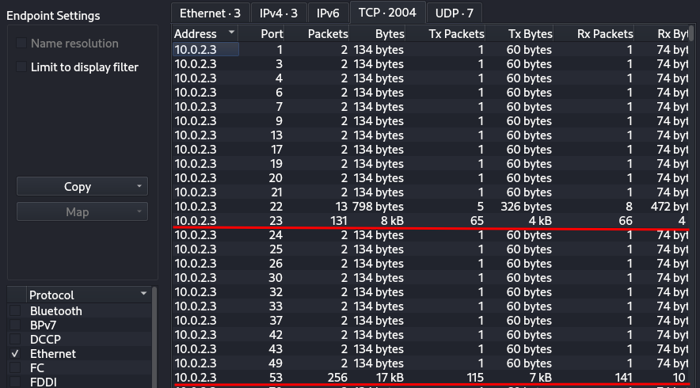
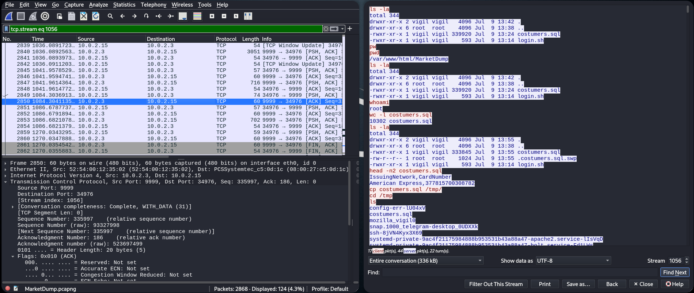
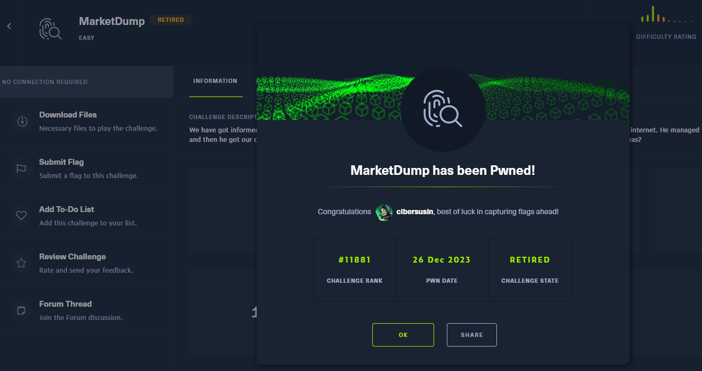

# MarketDump - Easy (HTB Challenge)
MarketDump (Volcado de mercado) es un reto "fácil" para analizar ficheros de tráfico.

## Descripción del reto (Traducción oficial)
Nos informaron que un pirata informático logró ingresar a nuestra red interna después de navegar a través de la plataforma web que se ejecuta en la Internet pública. Logró eludir nuestra plataforma de registro de existencias de productos pequeños y luego obtuvo el archivo de nuestra base de datos de clientes. Creemos que sólo uno de nuestros clientes fue el objetivo. **¿Puedes averiguar quién era el cliente?**

## Preparación del entorno
En nuestro Kali Linux nos descargamos el fichero zip, y lo descomprimimos encontrando un pcapng

# Enumeración
Recopilamos y entendemos de que se trata la información de tráfico buscando de una forma ordenada.
## Equipos
Lo primero es saber entre que equipos se están efectuando el tráfico de red, por lo que listaremos los equipos: En el panel superior vamos a "Statistics" > "Endpoints", y en la pestaña IPv4 identificamos 2 equipos.
- 10.0.2.3 : Cliente  
- 10.0.2.15 : Servidor

## Protocolos
Hayamos de una forma muy rápida que se ha producido una **enumeración de puertos en el servidor**, ya que vemos una clara secuencia de un paquete enviado, aquellos que la información de Bytes es diferente a 134B es que está abierto o filtrado. **Puertos como el 23 (Telnet) y el 53 (dns) responden.**

Otra forma es realizar la busqueda desde "Statistics" > "Protocol Hierarchy".

### Comunicación Telnet
Realizamos un filtrado: **tcp.port==23** y visualizamos la comunicación: "Analyze" > "Follow" > TCP Stream.

Una vez visualizando detectamos que han accedido con admin/admin y que se abre una conexión en el puerto 9999 con netcat 

### Comunicación Netcat
Ahora filtramos con el puerto 9999 para entender esa comunicación **tcp.port==9999** y también analizamos el TCP stream.

# Solución
Analizando el dump de la base de datos de clientes encontramos un código de cliente más largo que el resto, así que copiamos la clave, entendemos que está codificada o cifrada.

Utilizamos cyberchef con su función "Magic" que determinará que función aplicar a la clave. Y detectamos que era Base58.

